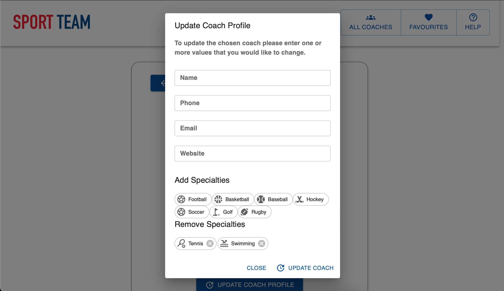

# Sport Team 

A Coach viewing application built using Next.js, Typescript and GraphQL.




<!-- Table of Contents -->

## Table of Contents

- [Overview](#overview)
- [Features](#features)
- [Further Goals](#further-goals)
- [Use Case](#use-case)
- [Todos](#todos)
- [Installation](#installation)
  - [Setting Up The Database](#setting-up-database)
  - [Setting up Dev Server](#dev-server)
  - [Generate Types](#types)

<!-- Features -->

## Features

- The User can view all available Coaches
- Coaches can be sorted and filtered by their specialty.
- Profile page for each Coach, complete with the ability to update specialties and details.
- The profile pages make use of SSR, we could expand this to the whole application using the cache and an initial props value but I've just done it per coach's profile page for now.
- I used Material UI's latest v5 update. I styled it using the brand colours and v5 specifications for styling conventions.
- Media queries cover tablet use of the application for staff in the stores.
- Pagination to not overload the user with all the coaches.
- Ability to favourite the coaches that are your favourite. I used Apollo's Reactive variables for this, we could also expand this to persist between sessions by using the[apollo-3-cache-persist](https://github.com/apollographql/apollo-cache-persist).

<!-- Further Goals -->

## Further Goals

- I'd like to implement endless scrolling, I started working on it but with the auto generated types I didn't want to duplicate any of my backend logic. I saw we'd need to create a new resolver so we could get the cursor logic onto the coaches and felt like offset pagination would work for now as an MVP.

<!-- Use Case -->

## Use Case

Sport Team displays a dynamic list of sports coaches on the website. In order to be able to create new and edit existing entries, we provide an interface for our team to accomplish those tasks.

<!-- Todos -->

## Todos

- [x] Write graphql queries against https://localhost:3000/api
- [x] Create a UI to list all our coaches at Sport-Thieme with the Material-UI components (already installed)
- [x] Create a UI for a single coach with the Material-UI components (already installed)
- [x] Implement at least one mutation updating the coaches
- [x] Implement a mutation for adding specialties to the coach
- [x] Implement pagination or endless scrolling to the coach list
- [x] Implement sorting to the coach list
- [x] Use Apollo reactive variables to create a local state to mark coaches as favourite
- [x] Implement SSG or SSR

<!-- Installation -->

## Installation

```bash
yarn
```

<!-- Setting Up Database -->

## Setting up the local database

```bash
yarn setup
```

This will create a sqLite database in the prisma folder and seeds some data for you.
You only need to run this once.

<!-- Dev Server -->

## Starting the dev server

```bash
yarn dev
```

Open [http://localhost:3000](http://localhost:3000) with your browser to see the result.

You can start editing the page by modifying `pages/index.tsx`. The page auto-updates as you edit the file.

<!-- types -->

## Generate types

As we are in a local app with a local server, please run the generate:types yourself.
In other sport-team projects, this will be done pre dev server start automatically.

Please be aware that the graphql server must be running (`yarn dev`) for this to work.

```bash
yarn generate:types
```


---

[Top](#table-of-contents)

---

</div>
